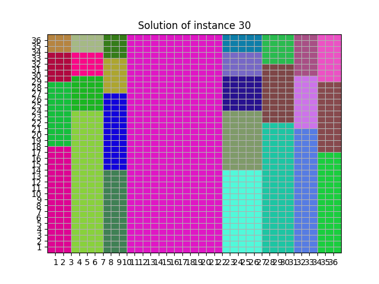
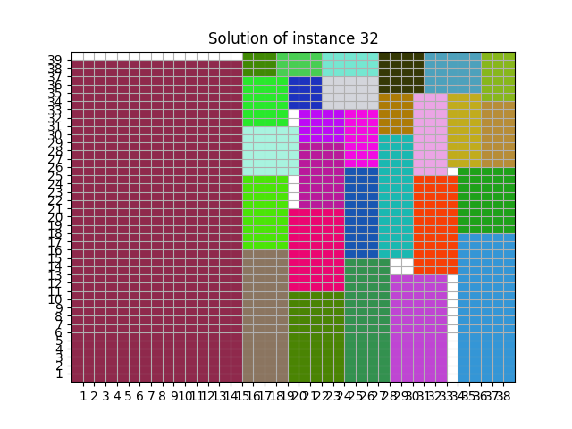

# rectangle-packing

Problem solved using Constrained Programming (CP) and Satisfiability Modulo Theories (SMT).
The problem consists in finding the minimum height of a box given a fixed width, such that it can contains a set of smaller rectangles without overlapping.  
It's a simplified version of the VLSI problem.
More information can be found in the [report](https://github.com/TiaBerte/rectangle-packing/blob/main/report.pdf).
Below examples of optimal and non optimal solutions.

